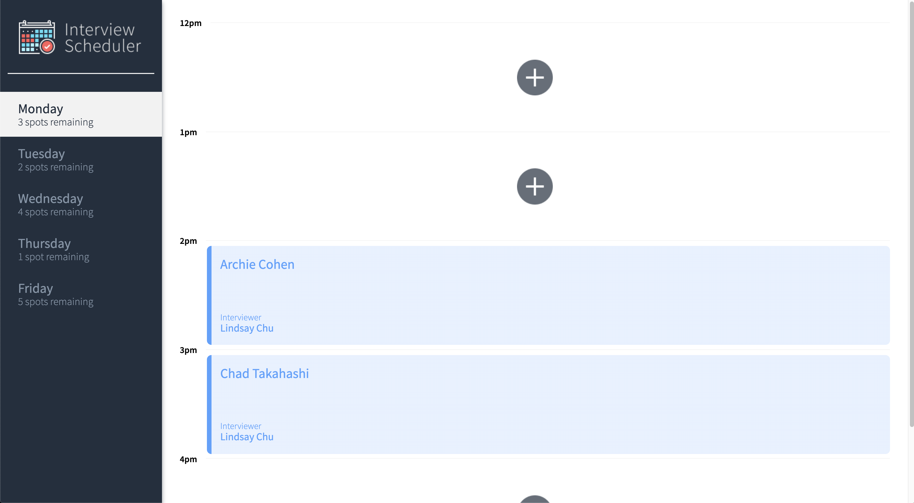
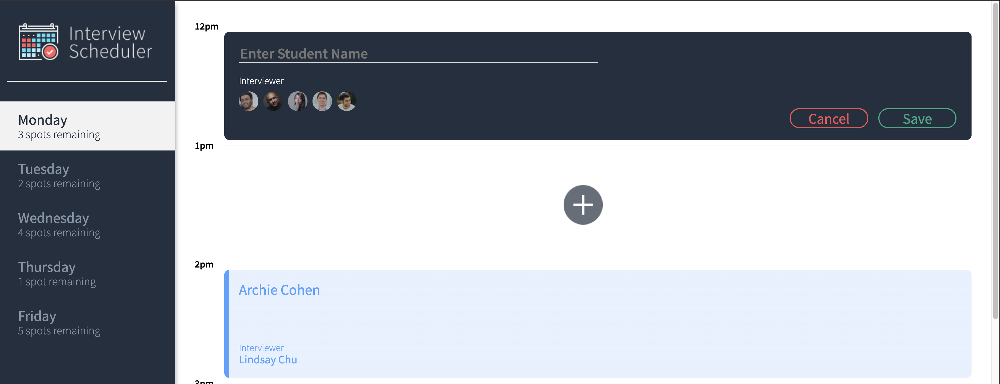
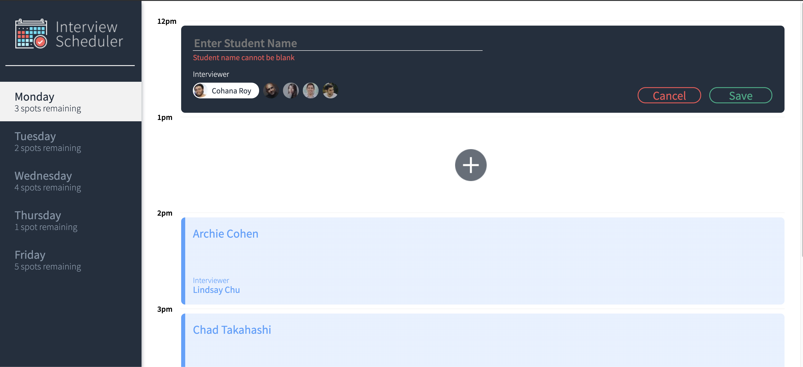
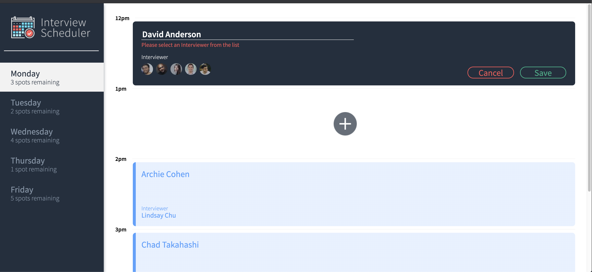
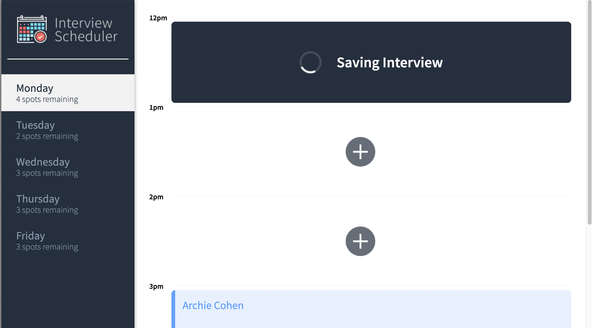
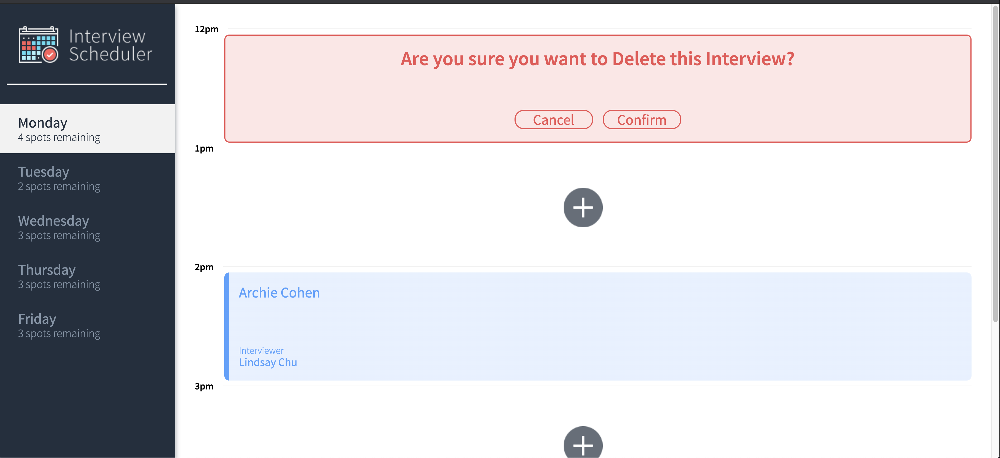
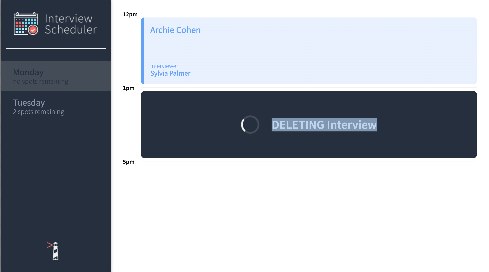

# Interview Scheduler

Scheduler is a React Application that allows users to set up an interview for a day of the week based on interviewers available on the particular day.

All data is stored in a local Postgres Database. Instructions and Repository for Database API is included below.

Includes Integration Tests (using JEST) and End-To-End Tests (using Cypress Framework).


## Final Product









## Setup
Install dependencies with `npm install`.

## Running Webpack Development Server
Starts the Webpack Development Server with live reload on changes made to the React App
```sh
npm start
```

## Running Jest Test Framework
Runs Tests using the Jest Framework
```sh
npm test
```

## Running Storybook Visual Testbed
Opens Storybook
```sh
npm run storybook
```

## Local DB instructions
Navigate to [Scheduler-API](https://github.com/kaushikmehta/scheduler-api) and follow instructions to set up a local Postgres Database
